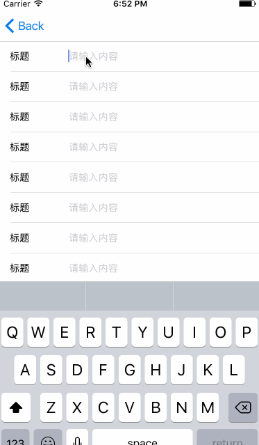
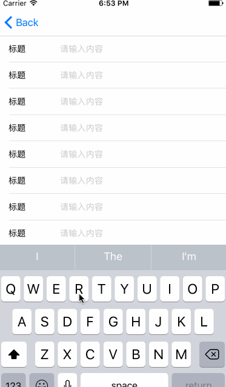
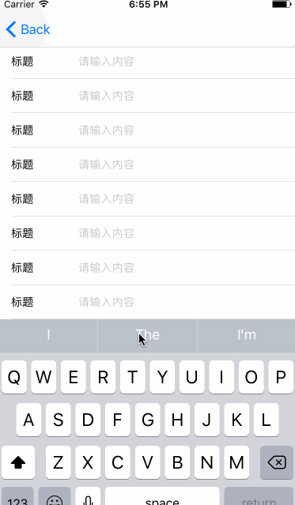

当TextView遇到了tableView，实现高度自适应与输入时候高度自适应
===


**思考几个问题**
> * TextView 如果userInteractionEnabled为NO可以当label使用吗？
> * TextView 如果加了placeholder 可以当TextField使用吗？
> * TextView 高度自适应可以替代label的自适应么？

iPhone开发中，会尽量用选择代替输入，如果输入逃避不了，那就面对吧。本文讲述如何让你的**TextView**实现高度自适应与输入时候高度自适应，这里我直接使用**tableviewController**，因为不用关注键盘的问题，自己可以完美处理。**搞技术的最接受不了废话，直接上图、上代码压压惊**





在tableview控制器中，代码如下

```

@implementation TableViewController

- (void)viewDidLoad {
    [super viewDidLoad];
    [self.tableView registerClass:[LSTextViewCell class] forCellReuseIdentifier:@"cell"];
}

-(void)dealloc{
    NSLog(@"%@销毁了", self.class.description);
}

- (void)didReceiveMemoryWarning {
    [super didReceiveMemoryWarning];
    // Dispose of any resources that can be recreated.
}

#pragma mark - Table view data source
- (NSInteger)tableView:(UITableView *)tableView numberOfRowsInSection:(NSInteger)section {

    return 10;
}

- (UITableViewCell *)tableView:(UITableView *)tableView cellForRowAtIndexPath:(NSIndexPath *)indexPath {
    LSTextViewCell *cell = [tableView dequeueReusableCellWithIdentifier:@"cell"];
  
    __weak typeof(self) weakSelf = self;
    cell.textView.textHeightChangeBlock = ^(NSString *text, CGFloat textHeight) {
        [weakSelf.tableView beginUpdates];
        [weakSelf.tableView endUpdates];
    };
    
    // Configure the cell...
    
    return cell;
}

-(CGFloat)tableView:(UITableView *)tableView estimatedHeightForRowAtIndexPath:(NSIndexPath *)indexPath{

    return UITableViewAutomaticDimension;
}

-(CGFloat)tableView:(UITableView *)tableView heightForRowAtIndexPath:(NSIndexPath *)indexPath{
    
    return UITableViewAutomaticDimension;
}

```

猫腻在下面代码里了

```
[weakSelf.tableView beginUpdates];
[weakSelf.tableView endUpdates];

```


***
####高度自适应
之前的文章（[cell高度自适应，约束优先级对布局的影响](http://www.jianshu.com/p/9951f4ed1141)））讲述过cell高度自适应，就是要有足够准确的约束，特别是约束优先级的设定。
一向忠于XIB的我这次放弃了用XIB，用[Masonry](https://github.com/SnapKit/Masonry)去布局了。其实我觉得用Masonry之前最好是把XIB用的熟练了，再用Masonry会有事半功倍的效果，个人理解。

要让**Label**去自适应高度，当然这个**numberOfLines**属性很重要，其实这个属性设置 **0~n** 都能够自适应的，顶多设置3，那么最大高度就是三行了。如果**TextView**呢，网友告诉我  **scrollEnabled** 为NO，就行了，要么你主动调用下**sizeThatFit**。为了达到**Label**的效果，这里我们自定义一个**TextView** 加一个** numberOfLines** 和 **高度变化了回调** 的属性，具体实现可参照git上的代码。

这里就说一下文本框的约束吧，优先级问题会影响到cell高度变化时候的显示问题，先看下约束

```
//顶部的约束优先级最高，那么会先改变约束优先级高的，这样避免了底部在输入的换行自适应是的上下跳动问题
[self.textView mas_makeConstraints:^(MASConstraintMaker *make) {
    make.top.equalTo(self.contentView.mas_top).offset(5).priority(999);
    make.height.mas_greaterThanOrEqualTo(@(14)).priority(888);
    make.bottom.equalTo(self.contentView.mas_bottom).offset(-5).priority(777);
    make.left.equalTo(self.contentView.mas_left).offset(100 - 5);
    make.right.equalTo(self.contentView.mas_right).offset(-15);
}];

```

三个优先级，那么最顶部的约束到底部依次降低，值依次为**999** **888** **777** (差距大是为了突出下，具体数值小宇1000并递减就可以)，可以保证输入时候高度更新的流畅，高度约束**mas_greaterThanOrEqualTo** 就能保证高度自增高，不用再次去**update**约束了，自适应当然就是一次约束一直约束更好了，为啥？因为少写两行代码，哈哈！

以上的约束在xib中直接用约束也可以，这里就不演示了，有兴趣的同学可以试试。

**还是推荐先学习XIB，再学习Masonry，因为XIB不用运行代码就可直观的看到约束和冲突……** 个人理解个人理解，嘿……


***

感谢您阅读完毕，如有疑问，欢迎添加QQ:**714387953**(蜗牛上高速)。
**github**:[https://github.com/yhl714387953/TextViewInCell](https://github.com/yhl714387953/TextViewInCell)
如果有错误，欢迎指正，一起切磋，共同进步
如果喜欢可以**Follow、Star、Fork**，都是给我最大的鼓励。


